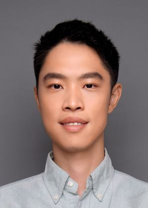

# About Me

Here is **Yaoyu Zhang (张耀宇)**. 

I am a Tenure-track Associate Professor at the Institute of Natural Sciences and School of Mathematical Sciences of Shanghai Jiao Tong University. I earned my Bachelor's degree in Physics (minor in mathematics) in 2012, and Ph.D. in Mathematics in 2016 from Shanghai Jiao Tong University adviced by David Cai and Douglas Zhou. From 2016 to 2020, I conducted postdoctoral research at New York University Abu Dhabi & Courant Institute, as well as the Institute for Advanced Study in Princeton. My research focuses on the theoretical foundation of deep learning, particularly the nonlinear training dynamics and condensation phenomenon of deep learning.

Feel free to reach out to me at - zhyy.sjtu [at] sjtu.edu.cn

<!--
 **Thank you!**
 -->

---

## Research Interests

#### Deep Learning Theory
- Nonlinear training dynamics and implicit bias
- Condensation phenomenon and theory
- Loss landscape structure

My research focuses on the theoretical foundation of deep learning. Since 2020, I have been particularly interested in analyzing the nonlinear training dynamics of neural networks, with a focus on the condensation phenomenon. We have made exciting progress in recent years, including identifying the dynamical regime of condensation, proving condensation at the initial training stage, discovering condensed critical points and manifolds (Embedding Principle), revealing condensation dynamics near the global minima, and quantifying the enhancement of sample efficiency through condensation (Optimistic Estimate). I am expecting to establish a unified theory of condensation in the coming years.

---

## News and Updates

- **June 2024**：Hello!

 
