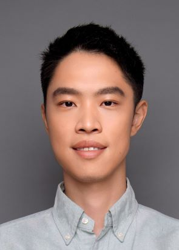

## About Me

Here is **Yaoyu Zhang (张耀宇)**. 

I am a Tenure-track Associate Professor at the Institute of Natural Sciences and School of Mathematical Sciences of Shanghai Jiao Tong University. I earned my Bachelor's degree in Physics (minor in mathematics) in 2012, and Ph.D. in Mathematics in 2016 from Shanghai Jiao Tong University adviced by David Cai and Douglas Zhou. From 2016 to 2020, I conducted postdoctoral research at New York University Abu Dhabi & Courant Institute, as well as the Institute for Advanced Study in Princeton. My research focuses on the theoretical foundation of deep learning, particularly the nonlinear training dynamics and condensation phenomenon of deep learning.

<!--
 **Thank you!**
 -->

---

## Research Interests

#### Deep Learning Theory
- Nonlinear training dynamics and implicit bias
- Condensation phenomenon and theory
- Loss landscape structure

My research focuses on the theoretical foundation of deep learning. Since 2020, I have been particularly interested in analyzing the nonlinear training dynamics of neural networks, with a focus on the condensation phenomenon. We have made exciting progress in recent years, including identifying the dynamical regime of condensation, proving condensation at the initial training stage, discovering condensed critical points and manifolds (Embedding Principle), revealing condensation dynamics near the global minima, and quantifying the enhancement of sample efficiency through condensation (Optimistic Estimate). I am expecting to establish a unified theory of condensation in the coming years.

---

## Selected Materials

#### Overview of Current Research Program

An overview of our research efforts and future directions in understanding the condensation phenomenon of deep learning. By advancing our current research program, we anticipate developing a novel framework that establishes a rigorous mathematical foundation for deep learning. See [Publications](https://yaoyuzhang1.github.io/publications/) for details.

#### Short Course

**Precourse Lecture at MLPDES25:**

The condensation phenomenon of Deep Neural Networks ([slides](https://mod.fau.eu/wp-content/uploads/FAUMoD_MLPDES25_slides_zhangY_29apr2025.pdf),[video](https://vp-cdn-balance.rrze.uni-erlangen.de/symlinks/bb5607d0-a8d3-41b1-b48e-4d06b1275b34.m4v))

**[Towards a Mathematical Foundation of Deep Learning: From Phenomena to Theory.](https://mod.fau.eu/fau-mod-course-towards-a-mathematical-foundation-of-deep-learning-from-phenomena-to-theory/)** 

FAU MoD Course, Friedrich-Alexander-Universität Erlangen-Nürnberg, Germany, May 2-8, 2025. 

Session titles:
1. **Mysteries of Deep Learning** ([slides](https://yaoyuzhang1.github.io/file/Lectures/I.Mysteries%20of%20deep%20learning.pdf),[video](https://vp-cdn-balance.rrze.uni-erlangen.de/symlinks/03a84c99-fe80-4d19-b240-a106c25de383.m4v))
2. **Frequency Principle/Spectral Bias** ([slides](https://yaoyuzhang1.github.io/file/Lectures/II.Frequency%20principle.pdf),[video](https://vp-cdn-balance.rrze.uni-erlangen.de/symlinks/3f263f0f-064e-49b8-ab34-bb8f40ce8b5d.m4v))
3. **Condensation Phenomenon** ([slides](https://yaoyuzhang1.github.io/file/Lectures/III.Condensation%20phenomenon.pdf),[video](https://vp-cdn-balance.rrze.uni-erlangen.de/symlinks/c2204f10-86de-444a-af2b-f5562e5fb0a4.m4v))
4. **From Condensation to Loss Landscape Analysis** ([slides](https://yaoyuzhang1.github.io/file/IV.From%20condensation%20to%20loss%20landscape%20analysis.pdf),[video](https://vp-cdn-balance.rrze.uni-erlangen.de/symlinks/3a873a0f-40a8-4dfa-b8d5-10cc09913845.m4v))
5. **From Condensation to Generalization Theory** ([slides](https://yaoyuzhang1.github.io/file/Lectures/V.From%20condensation%20to%20generalization%20theory.pdf),[video](https://vp-cdn-balance.rrze.uni-erlangen.de/symlinks/e634374b-b87a-4576-8a63-9c3c26980c1f.m4v))

#### Presentations
- **The Condensation Phenomenon of Deep Neural Networks.** MaD Seminar, New York University, U.S.A., Feb. 13, 2025. ([slides](https://yaoyuzhang1.github.io/file/Lectures/condensation_courant_0213.pdf))
- **Optimistic Sample Size Estimate for Deep Neural Networks.** One World Seminar Series on the Mathematics of Machine Learning, Oct. 9, 2024. ([slides](https://yaoyuzhang1.github.io/file/Lectures/Optimistic%20estimate.pdf), [video](https://youtu.be/s2jNsXmga6A))
- **Embedding Principle of Loss Landscape of Deep Neural Networks.** Online, 机器学习联合研讨计划, Oct. 16, 2021. ([slides](https://yaoyuzhang1.github.io/file/Lectures/E-Principle_slides.pdf), [video](https://www.bilibili.com/video/BV1x44y1x7Qg))
- **Dynamics of Deep Neural Networks--A Fourier Analysis Perspective.** Institute for Advanced Study, Princeton, Oct. 4, 2019.([slides](https://yaoyuzhang1.github.io/file/Lectures/dynamics%20of%20DNN.pdf), [video](https://www.ias.edu/video/postdoc/2019/1004-YaoyuZhang))

#### Lecture Note

- **深度学习现象导论（Introduction to Deep Learning Phenomena）**([Chinese version](https://yaoyuzhang1.github.io/file/Lectures/Intro_DL_Phenomena.pdf))([Git Repo](https://github.com/xuzhiqin1990/understanding_dl))

---
<!--
## News and Updates

- **June 2024**：Hello!

 
-->
